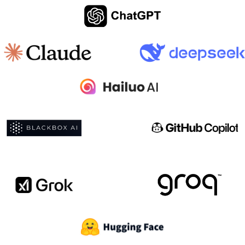

# Example of Tetris Game by AI Tools

Only 1 prompt has been used to create the game. The prompt is:

```
Create good Tetris game in Python.
```

### There are used below AI tools:




- OpenAI (gpt-4o, gpt-o1, gpt-o3-mini, gpt-o3-mini-high) https://chatgpt.com/
- Claude.ai (3.5 Sonnet) https://claude.ai/new
- Chat.deepseek.com https://chat.deepseek.com/
- Hailuo.ai https://www.hailuo.ai/
- Github.com/copilot https://github.com/copilot
- Groq.com (LLama-3.3-70B-Versatile) https://groq.com/
- X.com/i/grok https://x.com/i/grok
- Hugging Face (Qwen2.5-Coder-32B-Instruct) https://huggingface.co/chat/
- Qwen2.5-Max https://chat.qwenlm.ai/


## What do you think which AI tool is the best for creating good Tetris game in Python?

You can test it yourself. Just run the script and play the game.

```bash
python tetris-blackbox.ai.py
```

```bash
python tetris-claude.ai-3.5-Sonnet.py
```

```bash
python tetris-deepseek.py
```

```bash
python tetris-github-copilot.py
```

```bash
python tetris-groq-llama-3.3-70b-versatile.py
```

```bash
python tetris-hailuo.ai.py
```

```bash
python tetris-hf-Qwen2.5-Coder-32B-Instruct.py
```

```bash
python tetris-openai-4o.py
```

```bash
python tetris-openai-o1.py
```

```bash
python tetris-openai-o3-mini.py
```

```bash
python tetris-openai-o3-mini-high.py
```

```bash
python tetris-qwen2.5-max.py
```

```bash
python tetris-x-grok.py
```

* IMPORTANT: Some scripts are not working properly or not working at all.
I didn't add request to fix it. Only 1 prompt has been used to create the game.